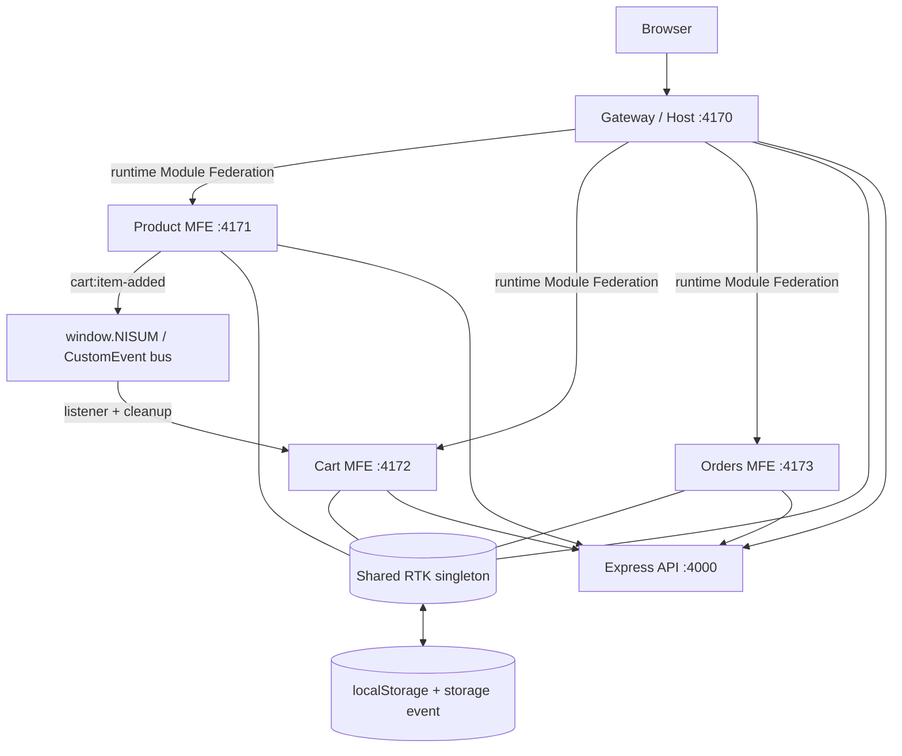

# Nisum Commerce Hub — React Micro Frontend Platform

## Overview

Nisum Commerce Hub is a production-oriented e-commerce platform built as a **Vite + React micro frontend monorepo**. It demonstrates runtime Module Federation, Redux Toolkit shared state, browser-event communication, an Express API, tests, CI/CD, Docker, and deployment-ready configuration.

The gateway never imports a remote's source code. It requests each remote's `remoteEntry.js` at runtime and renders its exposed component behind a loading/error boundary.

## Business Scenario

An online retailer needs Catalog, Cart, and Order History teams to release independently without a monolithic frontend release. The Gateway team owns composition and the platform experience; the API team owns data and validation.

## Architecture



### Architecture Diagram

```text
                         ┌────────────────────────┐
                         │ Gateway / Shell (Host) │
                         │  layout, routing, UX   │
                         └───────────┬────────────┘
                 Module Federation   │
            ┌──────────────┬─────────┴─────────┬──────────────┐
            ▼              ▼                   ▼              ▼
      Product MFE      Cart MFE            Orders MFE      Shared libs
      catalog/API      event listener      auth/orders     types/UI/state/events
            │              │                   │
            └──────────────┴───────┬───────────┘
                                   ▼
                     Express Commerce API / health
```

## Technologies Used

- React 19, TypeScript, Vite 6, and `@module-federation/vite`
- Redux Toolkit + React Redux for singleton shared application state
- React Router, Express 5, and CORS
- Vitest + Testing Library, ESLint, GitHub Actions
- Docker, Nginx, and Docker Compose

## Project Structure

```text
apps/
  gateway/        Module Federation host and shell
  products-mfe/   Remote: catalog and add-to-cart event publisher
  cart-mfe/       Remote: event listener, cart UI, checkout
  orders-mfe/     Remote: authenticated order history (bonus)
  api/            Express REST API
libs/
  shared-types/   Product, cart, auth, order, flag, event contracts
  shared-ui/      Generic Button, Card, Loader, ErrorBoundary
  state/          RTK store/actions/selectors and storage synchronisation
  events/         Typed window.NISUM CustomEvent abstraction
  api-client/     Typed frontend API client/error normalisation
.github/workflows/ CI and CD
infra/nginx/      SPA and health-check configuration
```

## Applications

### Gateway

`apps/gateway` is the host at `http://localhost:4170`. It owns routing, navigation, login, remote loading fallbacks, layout, feature-flag configuration, notifications, client error logging, and the singleton Redux `Provider`.

### MFE 1 — Product Catalog

`apps/products-mfe` exposes `./ProductsPage`. It loads the API catalog with loading/error/retry states, provides search, and publishes `cart:item-added`.

### MFE 2 — Shopping Cart

`apps/cart-mfe` exposes `./CartPage` and `./CartPanel`. The persistent panel subscribes to `cart:item-added`, commits it to RTK state, and returns an unsubscribe callback on unmount. Checkout uses the API and emits `order:created`.

### MFE 3 — Orders (Bonus)

`apps/orders-mfe` exposes `./OrdersPage`. It consumes the shared authenticated RTK session, loads order history from the API, and appends a just-created order from its event. The Gateway hides it when the server flag is off.

### Backend

`apps/api` runs at `http://localhost:4000`. It returns meaningful data and errors, validates input/auth, emits JSON request logs, and provides health checks.

| Method | Endpoint            | Purpose                        |
| ------ | ------------------- | ------------------------------ |
| GET    | `/health`           | Container/API health check     |
| GET    | `/api/config`       | Feature flags                  |
| GET    | `/api/products`     | Product catalog                |
| GET    | `/api/products/:id` | One product                    |
| POST   | `/api/auth/login`   | Demo authentication session    |
| GET    | `/api/orders`       | Authenticated order history    |
| POST   | `/api/orders`       | Validate cart and create order |

## Module Federation

Each remote owns a Vite federation configuration and exposes a stable public contract:

| Remote  | Remote entry environment variable | Exposed module(s)                         |
| ------- | --------------------------------- | ----------------------------------------- |
| Product | `VITE_PRODUCTS_REMOTE_URL`        | `products_mfe/ProductsPage`               |
| Cart    | `VITE_CART_REMOTE_URL`            | `cart_mfe/CartPage`, `cart_mfe/CartPanel` |
| Orders  | `VITE_ORDERS_REMOTE_URL`          | `orders_mfe/OrdersPage`                   |

The host uses `React.lazy()` and `Suspense` for runtime composition, plus a reusable error boundary for an unavailable remote. React, React DOM, React Redux, Redux Toolkit, Router, and the `@nisum/*` libraries are shared singleton dependencies. Remotes are independently runnable.

## Monorepo Architecture

This is a native npm-workspaces monorepo rather than Nx. It provides the needed monorepo properties with less ceremony: separate application/library packages, a single lockfile, explicit dependency contracts, per-workspace builds, and a root quality gate. For example: `npm run build --workspace=@nisum/cart-mfe`.

## Shared Libraries

- `@nisum/shared-types`: common product, cart, auth, order, feature, and event payload contracts.
- `@nisum/shared-ui`: generic Button, Card, Loader, InlineError, and ErrorBoundary—no business logic.
- `@nisum/state`: shared RTK store and typed hooks, plus safe cart persistence/cross-tab hydration.
- `@nisum/events`: public event bus and `Window.NISUM` type declaration.
- `@nisum/api-client`: typed REST requests and normalized `ApiError` handling.

## Global State

`@nisum/state` is federated as a shared singleton. It stores meaningful durable application state:

```ts
{
  auth: { user, token, status },
  cart: { items },
  preferences: { theme },
  features: { orders, productSearch }
}
```

Product publishes a business occurrence rather than importing Cart. Cart commits it to state. Gateway reads the item count and identity, Cart uses items for checkout, and Orders consumes the shared auth session.

## Event-Driven Architecture

```text
Product MFE ── NISUM.emit('cart:item-added', payload) ──► window CustomEvent
                                                            │
Cart MFE CartPanel ◄── NISUM.listener('cart:item-added') ───┘
      │
      └── RTK dispatch(addItem) → Gateway counter + Cart Page + localStorage
```

Cart checkout emits `cart:checkout-requested`, `order:created`, and `notification:show`. Gateway listens for notifications/logging; Orders adds the created order while mounted.

## NISUM Event System

The framework-neutral browser event API is typed and supports cleanup:

```ts
window.NISUM?.emit('cart:item-added', { product, quantity: 1 });
const stop = window.NISUM?.listener('cart:item-added', ({ product }) => {
  console.log(product.name);
});
stop?.();
```

It uses `CustomEvent`, `dispatchEvent`, and `addEventListener`, never another MFE's internal implementation. The Cart event bridge returns cleanup from `useEffect`; this is covered by tests.

## Data-Sharing Strategy

| Mechanism                        | Used for                                           | Coupling |            Persistence | Advantages                             | Limitations                          |
| -------------------------------- | -------------------------------------------------- | -------: | ---------------------: | -------------------------------------- | ------------------------------------ |
| Shared RTK state                 | cart, auth, theme, flags                           |   Medium | runtime + cart storage | consistent selectors/actions           | schema needs careful versioning      |
| `window.NISUM` events            | added item, checkout, order created, notifications |      Low |                     no | publisher does not know subscriber     | flows need contracts/logging         |
| Module Federation shared modules | React/RTK and `@nisum/*`                           |   Medium |                runtime | singleton framework/store dependencies | version compatibility management     |
| Browser Storage API              | refresh and cross-tab cart sync                    |      Low |                browser | works without API round trip           | browser-only, invalid data tolerated |
| Backend API                      | catalog, config, auth, orders                      |      Low |                 server | central source of truth/validation     | network dependency                   |

## Backend/API

Browser code reads `VITE_API_URL`; URLs are not source-coded. `ApiError` turns failed fetches and non-2xx responses into displayable errors. Catalog and Orders show loading, failure, and retry states. The API validates email, bearer authorization, cart item shape, and unknown routes.

## Error Handling

- **Remote unavailable:** loading UI followed by a retryable ErrorBoundary message; stop a remote to demonstrate.
- **Backend unavailable/API error:** normalized `ApiError` and a retryable MFE UI.
- **Invalid data:** safe Express 400/401/404 JSON errors; bad cart storage is discarded.
- **Event listener leak:** listener APIs return unsubscribe callbacks; Cart and Orders return them through `useEffect`.

## Testing

Run `npm test`. Tests cover:

- `window.NISUM` emit, payload delivery, listener registration, and unsubscribe
- RTK initialization, cart updates, and totals
- Product API rendering plus its event emission
- Cart event receipt and shared state update
- Orders shared-auth guard
- Gateway navigation/shell and remote loading boundary
- Backend catalog data and auth guard rules

`npm run lint`, `npm run typecheck`, and `npm run build` are separate quality gates. `npm run check` runs the complete local pipeline.

## CI/CD

`.github/workflows/ci.yml` runs on PRs and pushes to `main`: `npm ci`, lint, typecheck, tests, and every app build.

`.github/workflows/cd.yml` runs on a main push or manually. It publishes five independently deployable commit-SHA Docker images (Gateway, each remote, API) to GHCR. Set repository variable `DEPLOY_ENABLED=true` and secret `DEPLOY_WEBHOOK` to automatically call the deployment environment after image publication. Secrets stay outside source control.

## Environment Configuration

Copy `.env.example` to `.env.local` for local overrides. `.env.development` provides the safe local topology; `.env.production` supplies public placeholders. Never place a secret in `VITE_*`—those variables are bundled to the browser.

| Variable                   | Purpose                                  |
| -------------------------- | ---------------------------------------- |
| `VITE_API_URL`             | Public API base URL                      |
| `VITE_PRODUCTS_REMOTE_URL` | Product `remoteEntry.js` URL             |
| `VITE_CART_REMOTE_URL`     | Cart `remoteEntry.js` URL                |
| `VITE_ORDERS_REMOTE_URL`   | Orders `remoteEntry.js` URL              |
| `VITE_ENABLE_ORDERS`       | Browser-side Orders kill switch          |
| `ENABLE_ORDERS`            | API feature source (`false` disables it) |
| `API_DELAY_MS`             | Optional delay for loading-state demos   |

## Running the Application

Prerequisite: Node 20.19+ (Node 22 LTS recommended) and npm 10+.

```bash
npm install
npm run dev
```

```text
Gateway       http://localhost:4170
Product MFE   http://localhost:4171
Cart MFE      http://localhost:4172
Orders MFE    http://localhost:4173
Backend API   http://localhost:4000
```

Open the Gateway, add a catalog item, observe the Cart MFE update, sign in, checkout, then open Orders. Open a second tab to observe Storage API cart synchronization.

## Deployment

### Docker (Bonus)

```bash
docker compose up --build
```

This publishes the same browser-visible ports. Nginx frontends and the API expose health endpoints; Compose waits for API health before dependent frontends start.

Every app has its own Dockerfile and can deploy independently. In production, build the Gateway with versioned public remote URLs such as `https://catalog.example.com/remoteEntry.js`. Cache entries conservatively or use immutable paths. The public compatibility contracts are remote module path, shared type/event schema, and supported API version. An unavailable remote leaves the shell usable and renders only its error boundary.

## Architecture Decisions

1. **npm workspaces over Nx:** transparent package boundaries and a smaller training-project toolchain.
2. **RTK only for durable shared state:** cart/auth/preferences have multiple consumers; events are for transient business occurrences.
3. **Persistent Cart remote panel:** keeps Cart's listener mounted while Catalog is shown, so true Product-to-Cart communication is visible.
4. **Global browser events:** `window.NISUM` is framework-neutral and avoids direct remote coupling.
5. **Backend owns validation:** browser checks improve UX, but server endpoint rules remain authoritative.

## Challenges & Solutions

| Challenge                                   | Solution                                                    |
| ------------------------------------------- | ----------------------------------------------------------- |
| A remote may fail independently             | lazy loading plus visible ErrorBoundary/retry UI            |
| Duplicate React/RTK breaks Provider context | federation shares framework/platform packages as singletons |
| Events are transient but cart must persist  | Cart commits events to RTK and localStorage                 |
| Browser tabs need consistent cart state     | `storage` event hydrates external changes                   |
| Environment topology changes                | all remote/API URLs are environment values                  |

## Screenshots / Demo

Capture this walkthrough for the submission:

1. Gateway `/catalog`: Host navigation, Product remote, persistent Cart remote panel.
2. Click **Add to cart**: toast plus Cart count/item update (event → listener → RTK).
3. Sign in, open `/cart`, and complete checkout.
4. Open `/orders`: third remote consumes shared auth and displays the created order.
5. Stop a remote / API to show remote and API error states.
6. Show federation configs, `libs/events`, `libs/state`, workflows, and green CI.

## Future Improvements

- Replace demo login with OIDC and an httpOnly-cookie BFF.
- Persist carts/orders in a database and add checkout idempotency keys.
- Add remote contract, E2E, visual regression, OpenTelemetry, and real error tracking.
- Serve remotes through a CDN with signed manifests and staged compatibility checks.

## Conclusion

Commerce Hub shows how independently owned React MFEs compose into one cohesive application without direct internal dependencies: Module Federation composes code at runtime, RTK shares durable state, `window.NISUM` communicates business events, browser storage synchronizes tabs, and the API remains the server authority. The platform is modular, testable, independently deployable, and resilient when an individual capability is unavailable.
